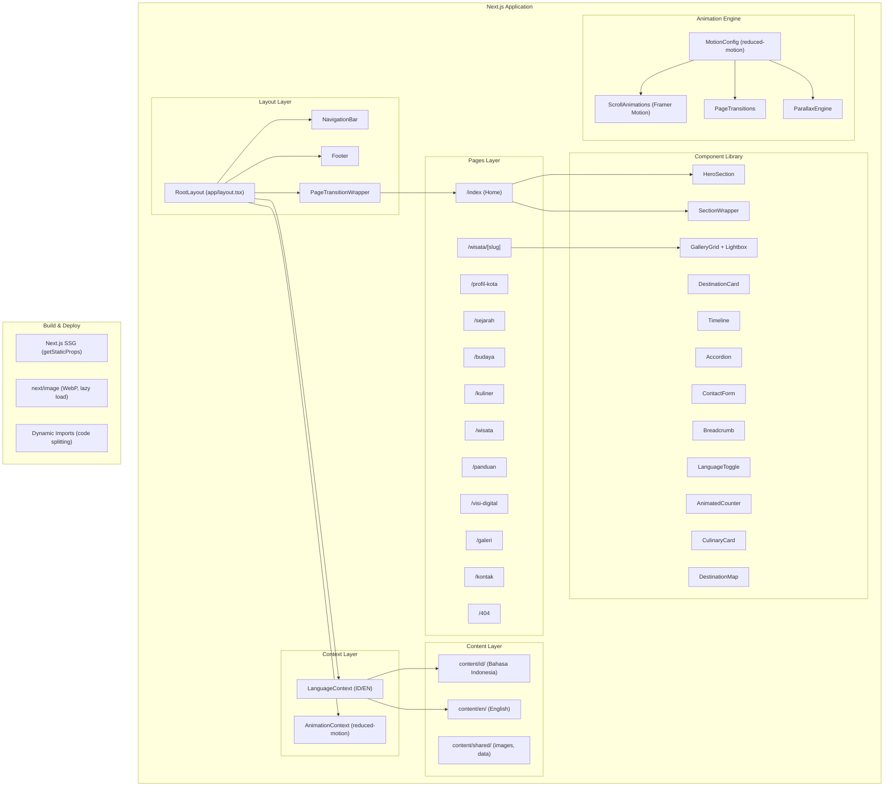

# Design Document

## Banjarmasin Tourism Website — "Kota Seribu Sungai"

---

## Overview

Website pariwisata interaktif Banjarmasin adalah platform Next.js multi-halaman yang dirancang sebagai pengalaman digital imersif. Arsitektur sistem dibangun di atas tiga pilar utama:

1. **Content Layer** — sistem konten bilingual (ID/EN) yang dipisahkan dari presentasi, disimpan sebagai TypeScript object literals yang diakses melalui React Context.
2. **Presentation Layer** — komponen React yang dapat digunakan ulang, diatur dalam Component Library dengan design token Tailwind CSS.
3. **Animation Layer** — Animation Engine berbasis Framer Motion yang mengelola semua transisi halaman, scroll-triggered animations, dan interaksi visual.

Pendekatan Static Site Generation (SSG) Next.js memastikan performa tinggi, sementara arsitektur berbasis komponen memungkinkan konsistensi visual di seluruh 15 halaman.

### Tujuan Desain

- **Imersif**: Setiap halaman terasa seperti babak dalam sebuah perjalanan, bukan sekadar halaman web.
- **Performant**: Lighthouse score ≥80 desktop, ≥70 mobile melalui SSG, image optimization, dan code splitting.
- **Accessible**: WCAG 2.1 AA compliance, semantic HTML, focus management, dan `prefers-reduced-motion` support.
- **Bilingual-first**: Konten ID/EN dikelola sebagai first-class concern, bukan afterthought.
- **Maintainable**: Pemisahan konten dari presentasi memudahkan pembaruan konten tanpa menyentuh kode komponen.

---

## Architecture

### System Architecture Diagram



### Technology Stack

| Layer | Technology | Rationale |
|-------|-----------|-----------|
| Framework | Next.js 14 (App Router) | SSG, file-based routing, image optimization bawaan |
| UI Library | React 18 | Component model, hooks, concurrent features |
| Styling | Tailwind CSS v3 | Utility-first, design token integration, responsive |
| Animation | Framer Motion v11 | Declarative animations, layout animations, scroll triggers |
| Typography | next/font (Google Fonts) | Zero layout shift, self-hosted font loading |
| Images | next/image | WebP conversion, lazy loading, responsive srcSet |
| Language | TypeScript | Type safety untuk content schema dan component props |
| Icons | Lucide React | Consistent icon set, tree-shakeable |

### Rendering Strategy

Semua halaman menggunakan **Static Site Generation (SSG)** via `generateStaticParams` (App Router):

- Halaman statis (Home, Profil Kota, dll): `export const dynamic = 'force-static'`
- Sub-halaman destinasi (`/wisata/[slug]`): `generateStaticParams()` menghasilkan 5 slug statis
- Tidak ada server-side rendering yang diperlukan karena konten tidak berubah secara real-time

---

## Components and Interfaces

### Folder Structure

```
banjarmasin-tourism/
├── app/
│   ├── layout.tsx                    # Root layout: providers, fonts, metadata
│   ├── page.tsx                      # Home (/)
│   ├── profil-kota/
│   │   └── page.tsx
│   ├── sejarah/
│   │   └── page.tsx
│   ├── budaya/
│   │   └── page.tsx
│   ├── kuliner/
│   │   └── page.tsx
│   ├── wisata/
│   │   ├── page.tsx                  # /wisata (index)
│   │   └── [slug]/
│   │       └── page.tsx              # /wisata/[slug]
│   ├── panduan/
│   │   └── page.tsx
│   ├── visi-digital/
│   │   └── page.tsx
│   ├── galeri/
│   │   └── page.tsx
│   ├── kontak/
│   │   └── page.tsx
│   └── not-found.tsx                 # Custom 404
│
├── components/
│   ├── layout/
│   │   ├── NavigationBar.tsx
│   │   ├── Footer.tsx
│   │   ├── Breadcrumb.tsx
│   │   └── PageTransitionWrapper.tsx
│   ├── ui/
│   │   ├── HeroSection.tsx
│   │   ├── SectionWrapper.tsx
│   │   ├── DestinationCard.tsx
│   │   ├── CulinaryCard.tsx
│   │   ├── GalleryGrid.tsx
│   │   ├── Lightbox.tsx
│   │   ├── Timeline.tsx
│   │   ├── Accordion.tsx
│   │   ├── ContactForm.tsx
│   │   ├── LanguageToggle.tsx
│   │   ├── AnimatedCounter.tsx
│   │   ├── DestinationMap.tsx
│   │   └── VideoEmbed.tsx
│   └── animations/
│       ├── FadeInView.tsx            # Scroll-triggered fade-in wrapper
│       ├── SlideInView.tsx           # Scroll-triggered slide-up wrapper
│       ├── ParallaxContainer.tsx     # Parallax scroll effect wrapper
│       └── StaggerContainer.tsx     # Staggered children animation
│
├── content/
│   ├── types.ts                      # TypeScript interfaces untuk semua content
│   ├── id/                           # Bahasa Indonesia content
│   │   ├── home.ts
│   │   ├── profil-kota.ts
│   │   ├── sejarah.ts
│   │   ├── budaya.ts
│   │   ├── kuliner.ts
│   │   ├── wisata.ts
│   │   ├── destinations/
│   │   │   ├── pasar-terapung-lok-baintan.ts
│   │   │   ├── menara-pandang-siring.ts
│   │   │   ├── kampung-sasirangan.ts
│   │   │   ├── masjid-sultan-suriansyah.ts
│   │   │   └── masjid-raya-sabilal-muhtadin.ts
│   │   ├── panduan.ts
│   │   ├── visi-digital.ts
│   │   ├── galeri.ts
│   │   └── kontak.ts
│   └── en/                           # English content (same structure)
│       └── ...
│
├── contexts/
│   ├── LanguageContext.tsx
│   └── AnimationContext.tsx
│
├── hooks/
│   ├── useLanguage.ts
│   ├── useScrollPosition.ts
│   └── useReducedMotion.ts
│
├── lib/
│   ├── content.ts                    # Content loader utilities
│   └── destinations.ts              # Destination data helpers
│
├── public/
│   ├── images/
│   │   ├── destinations/
│   │   ├── culinary/
│   │   ├── gallery/
│   │   └── hero/
│   └── videos/
│
├── styles/
│   └── globals.css                   # Tailwind directives + custom CSS
│
└── tailwind.config.ts                # Design tokens
```

### Core Component Interfaces

#### NavigationBar

```typescript
// components/layout/NavigationBar.tsx
interface NavigationBarProps {
  // No props — reads from LanguageContext internally
}

// Internal state
interface NavState {
  isScrolled: boolean;        // true when scrollY > 80px
  isMobileMenuOpen: boolean;
  isWisataDropdownOpen: boolean;
}
```

**Behavior:**
- Menggunakan `useScrollPosition()` hook untuk mendeteksi scroll > 80px
- Transisi background: `transparent` → `bg-river-blue/90 backdrop-blur-md` dalam 300ms
- Dropdown wisata: muncul saat hover pada desktop, tap pada mobile
- Mobile menu: full-screen overlay dengan `AnimatePresence` Framer Motion

#### HeroSection

```typescript
interface HeroSectionProps {
  variant: 'video' | 'parallax' | 'split' | 'cinematic';
  backgroundSrc: string;          // video URL atau image path
  backgroundAlt?: string;
  headline: BilingualText;
  subheadline?: BilingualText;
  cta?: {
    label: BilingualText;
    href: string;
    variant: 'primary' | 'secondary';
  };
  overlayOpacity?: number;        // 0–1, default 0.4
  parallaxFactor?: number;        // 0.3–0.5 untuk parallax variant
  children?: React.ReactNode;     // untuk konten tambahan di hero
}
```

#### SectionWrapper

```typescript
interface SectionWrapperProps {
  id?: string;
  className?: string;
  animationVariant?: 'fade' | 'slide-up' | 'stagger' | 'none';
  background?: 'white' | 'light' | 'dark' | 'gradient';
  children: React.ReactNode;
}
```

#### DestinationCard

```typescript
interface DestinationCardProps {
  destination: DestinationSummary;  // dari content types
  variant?: 'grid' | 'carousel' | 'featured';
  showCategory?: boolean;
}
```

#### Lightbox

```typescript
interface LightboxProps {
  images: GalleryImage[];
  initialIndex: number;
  isOpen: boolean;
  onClose: () => void;
}
```

#### Timeline

```typescript
interface TimelineProps {
  events: TimelineEvent[];
  orientation?: 'vertical' | 'horizontal';
}

interface TimelineEvent {
  year: string;
  title: BilingualText;
  description: BilingualText;
  imageSrc?: string;
  imageAlt?: BilingualText;
}
```

#### Accordion

```typescript
interface AccordionProps {
  items: AccordionItem[];
  allowMultiple?: boolean;  // default false (single open)
  animationDuration?: number; // ms, default 300
}

interface AccordionItem {
  id: string;
  question: BilingualText;
  answer: BilingualText;
}
```

#### ContactForm

```typescript
interface ContactFormProps {
  // No props — reads language from context, handles own state
}

interface FormState {
  nama: string;
  email: string;
  subjek: 'informasi-wisata' | 'kerjasama' | 'lainnya';
  pesan: string;
}

interface FormErrors {
  nama?: string;
  email?: string;
  subjek?: string;
  pesan?: string;
}
```

#### AnimatedCounter

```typescript
interface AnimatedCounterProps {
  value: number;
  suffix?: string;    // e.g., "km²", "juta", "+"
  prefix?: string;
  duration?: number;  // animation duration in ms, default 2000
  triggerOnView?: boolean; // default true (scroll-triggered)
}
```

### Animation Components

#### FadeInView

```typescript
interface FadeInViewProps {
  children: React.ReactNode;
  delay?: number;       // seconds, default 0
  duration?: number;    // seconds, default 0.6
  className?: string;
}
```

Menggunakan `useInView` dari Framer Motion dengan `once: true` untuk trigger satu kali saat elemen masuk viewport.

#### ParallaxContainer

```typescript
interface ParallaxContainerProps {
  children: React.ReactNode;
  factor?: number;      // parallax depth 0.3–0.5
  className?: string;
}
```

Menggunakan `useScroll` dan `useTransform` dari Framer Motion untuk menghitung offset Y berdasarkan scroll position.

#### StaggerContainer

```typescript
interface StaggerContainerProps {
  children: React.ReactNode;
  staggerDelay?: number;  // seconds between each child, default 0.1
  className?: string;
}
```

---

## Data Models

### Content Type System

```typescript
// content/types.ts

/** Teks bilingual — selalu memiliki versi ID dan EN */
interface BilingualText {
  id: string;   // Bahasa Indonesia
  en: string;   // English
}

/** Gambar dengan alt text bilingual */
interface BilingualImage {
  src: string;
  alt: BilingualText;
  width: number;
  height: number;
  photographer?: string;
}

/** Konten halaman generik */
interface PageContent {
  meta: PageMeta;
  hero: HeroContent;
  sections: SectionContent[];
}

interface PageMeta {
  title: BilingualText;
  description: BilingualText;
  ogImage: string;
}

interface HeroContent {
  backgroundSrc: string;
  backgroundAlt: BilingualText;
  headline: BilingualText;
  subheadline?: BilingualText;
  cta?: {
    label: BilingualText;
    href: string;
  };
}
```

### Destination Data Model

```typescript
/** Ringkasan destinasi untuk card dan listing */
interface DestinationSummary {
  slug: string;           // e.g., "pasar-terapung-lok-baintan"
  name: BilingualText;
  tagline: BilingualText;
  category: 'alam' | 'budaya' | 'religi' | 'kuliner';
  heroImage: BilingualImage;
  shortDescription: BilingualText;
  operatingHours: BilingualText;
  ticketPrice: BilingualText;  // "Gratis" / "Free" jika tidak ada tiket
}

/** Konten lengkap halaman destinasi */
interface DestinationDetail extends DestinationSummary {
  fullDescription: BilingualText;   // min 200 kata
  historicalBackground: BilingualText;
  culturalSignificance: BilingualText;
  gallery: BilingualImage[];        // min 6 gambar
  practicalInfo: {
    address: BilingualText;
    operatingHours: BilingualText;
    ticketPrice: BilingualText;
    visitingTips: BilingualText[];
    howToGetThere: BilingualText;
  };
  nearbyDestinations: string[];     // array of slugs
  structuredData: TouristAttractionSchema;
}

/** JSON-LD TouristAttraction schema */
interface TouristAttractionSchema {
  "@context": "https://schema.org";
  "@type": "TouristAttraction";
  name: string;
  description: string;
  address: {
    "@type": "PostalAddress";
    streetAddress: string;
    addressLocality: "Banjarmasin";
    addressRegion: "Kalimantan Selatan";
    addressCountry: "ID";
  };
  geo: {
    "@type": "GeoCoordinates";
    latitude: number;
    longitude: number;
  };
  openingHours: string;
  image: string;
}
```

### Language Context Model

```typescript
// contexts/LanguageContext.tsx

type Language = 'id' | 'en';

interface LanguageContextValue {
  language: Language;
  setLanguage: (lang: Language) => void;
  t: (text: BilingualText) => string;  // helper: returns text[language]
}

// localStorage key: 'banjarmasin-lang'
// Default: 'id'
```

### Gallery Data Model

```typescript
interface GalleryImage extends BilingualImage {
  id: string;
  category: 'sungai-alam' | 'budaya-tradisi' | 'kuliner' | 'arsitektur' | 'kehidupan';
  caption: BilingualText;
}

interface GalleryState {
  activeFilter: GalleryImage['category'] | 'all';
  lightboxOpen: boolean;
  lightboxIndex: number;
}
```

### Navigation Data Model

```typescript
interface NavItem {
  label: BilingualText;
  href: string;
  children?: NavItem[];  // untuk dropdown wisata
}

// Defined statically in NavigationBar component
const NAV_ITEMS: NavItem[] = [
  { label: { id: 'Beranda', en: 'Home' }, href: '/' },
  { label: { id: 'Profil Kota', en: 'City Profile' }, href: '/profil-kota' },
  { label: { id: 'Sejarah', en: 'History' }, href: '/sejarah' },
  { label: { id: 'Budaya', en: 'Culture' }, href: '/budaya' },
  { label: { id: 'Kuliner', en: 'Culinary' }, href: '/kuliner' },
  {
    label: { id: 'Destinasi Wisata', en: 'Destinations' },
    href: '/wisata',
    children: [
      { label: { id: 'Pasar Terapung Lok Baintan', en: 'Lok Baintan Floating Market' }, href: '/wisata/pasar-terapung-lok-baintan' },
      { label: { id: 'Menara Pandang Siring', en: 'Siring Observation Tower' }, href: '/wisata/menara-pandang-siring' },
      { label: { id: 'Kampung Sasirangan', en: 'Sasirangan Village' }, href: '/wisata/kampung-sasirangan' },
      { label: { id: 'Masjid Sultan Suriansyah', en: 'Sultan Suriansyah Mosque' }, href: '/wisata/masjid-sultan-suriansyah' },
      { label: { id: 'Masjid Raya Sabilal Muhtadin', en: 'Sabilal Muhtadin Grand Mosque' }, href: '/wisata/masjid-raya-sabilal-muhtadin' },
    ]
  },
  { label: { id: 'Panduan', en: 'Travel Guide' }, href: '/panduan' },
  { label: { id: 'Visi Digital', en: 'Digital Vision' }, href: '/visi-digital' },
  { label: { id: 'Galeri', en: 'Gallery' }, href: '/galeri' },
  { label: { id: 'Kontak', en: 'Contact' }, href: '/kontak' },
];
```

### Tailwind Design Tokens

```typescript
// tailwind.config.ts
const config = {
  theme: {
    extend: {
      colors: {
        'river-blue': {
          DEFAULT: '#1B3A5C',
          50: '#E8EEF5',
          100: '#C5D4E6',
          900: '#0D1E30',
        },
        'warm-gold': {
          DEFAULT: '#C9A84C',
          light: '#E8D08A',
          dark: '#9A7A2E',
        },
        'earth-terracotta': {
          DEFAULT: '#8B4513',
          light: '#C4713A',
          dark: '#5C2D0A',
        },
        'clean-white': '#F8F5F0',
      },
      fontFamily: {
        heading: ['Playfair Display', 'Georgia', 'serif'],
        body: ['Plus Jakarta Sans', 'Inter', 'sans-serif'],
      },
      fontSize: {
        'display-xl': ['4.5rem', { lineHeight: '1.1', letterSpacing: '-0.02em' }],
        'display-lg': ['3.5rem', { lineHeight: '1.15', letterSpacing: '-0.02em' }],
        'display-md': ['2.5rem', { lineHeight: '1.2', letterSpacing: '-0.01em' }],
      },
      animation: {
        'fade-in': 'fadeIn 0.6s ease-out forwards',
        'slide-up': 'slideUp 0.6s ease-out forwards',
        'counter': 'counter 2s ease-out forwards',
      },
      transitionDuration: {
        '250': '250ms',
        '300': '300ms',
        '400': '400ms',
      },
    },
  },
};
```

---

## Correctness Properties

*A property is a characteristic or behavior that should hold true across all valid executions of a system — essentially, a formal statement about what the system should do. Properties serve as the bridge between human-readable specifications and machine-verifiable correctness guarantees.*


### Property Reflection

Setelah meninjau semua kriteria yang teridentifikasi sebagai testable properties, berikut konsolidasi untuk menghilangkan redundansi:

- **11.5 dan 14.6** (lightbox opens on image click) → Keduanya menguji perilaku yang sama pada komponen `Lightbox` yang sama. Digabung menjadi **Property 6: Lightbox opens at correct index**.
- **3.1 dan 17.1** (bilingual content completeness) → Keduanya menguji bahwa BilingualText memiliki kedua field. Digabung menjadi **Property 1: Bilingual content completeness**.
- **2.2 dan 2.6** (threshold-based UI behavior) → Keduanya menguji threshold behavior (scroll 80px, viewport 768px). Keduanya unik dan tidak redundan — dipertahankan sebagai properti terpisah.
- **3.2 dan 18.5** (language switching renders correct text) → Keduanya menguji bahwa komponen merender teks yang benar berdasarkan bahasa aktif. Digabung menjadi **Property 2: Language context renders correct text**.
- **11.7 dan 12.7** (referential integrity of internal links) → Keduanya menguji bahwa link internal mengarah ke slug yang valid. Digabung menjadi **Property 9: Internal link referential integrity**.

### Correctness Properties

### Property 1: Bilingual Content Completeness

*For any* BilingualText or BilingualImage object in the content system (across all 15 pages), both the `id` and `en` fields must be non-empty strings with length > 0.

**Validates: Requirements 3.1, 17.1**

---

### Property 2: Language Context Renders Correct Text

*For any* component that accepts a `BilingualText` prop, when the active language is `'id'`, the component must render the `.id` string; when the active language is `'en'`, the component must render the `.en` string — and never the opposite.

**Validates: Requirements 3.2, 18.5**

---

### Property 3: Language Preference Persistence Round-Trip

*For any* language value in `{'id', 'en'}`, after calling `setLanguage(lang)` and reading back from `localStorage`, the stored value must equal the original `lang` value.

**Validates: Requirements 3.3**

---

### Property 4: Header Scroll Threshold Behavior

*For any* scroll position value `y`, when `y > 80`, the NavigationBar must have the opaque/dark background class applied; when `y <= 80`, the NavigationBar must have the transparent background class applied.

**Validates: Requirements 2.2**

---

### Property 5: Responsive Navigation Threshold

*For any* viewport width `w`, when `w < 768`, the hamburger menu icon must be visible and the full navigation menu must be hidden; when `w >= 768`, the full navigation menu must be visible and the hamburger icon must be hidden.

**Validates: Requirements 2.6**

---

### Property 6: Lightbox Opens at Correct Index

*For any* gallery with `n` images and any valid index `i` (where `0 <= i < n`), clicking the image at index `i` must open the Lightbox component with `initialIndex === i` and `isOpen === true`.

**Validates: Requirements 11.5, 14.6**

---

### Property 7: Gallery Filter Correctness

*For any* active filter category `c` (not 'all'), all images rendered in the GalleryGrid must have `image.category === c`. No image with a different category should be visible.

**Validates: Requirements 14.3**

---

### Property 8: Accordion Single-Open Invariant

*For any* sequence of Accordion item clicks on an Accordion with `allowMultiple: false`, at most one item must be in the expanded state at any point in time.

**Validates: Requirements 15.8**

---

### Property 9: Internal Link Referential Integrity

*For any* internal link `href` value in destination nearby cards or itinerary items, the href must match one of the 15 valid page paths defined in the routing system (10 main pages + 5 destination sub-pages). No internal link should point to an undefined route.

**Validates: Requirements 11.7, 12.7**

---

### Property 10: Destination Nearby Exclusion Invariant

*For any* destination with slug `s`, the `nearbyDestinations` array must contain exactly 4 slugs, and none of those slugs must equal `s` (a destination cannot link to itself as a nearby destination).

**Validates: Requirements 11.7**

---

### Property 11: Form Validation Error Coverage

*For any* contact form submission where one or more fields are invalid (empty required field or malformed email), the set of displayed validation error messages must exactly cover all and only the invalid fields — no false positives (errors on valid fields) and no false negatives (missing errors on invalid fields).

**Validates: Requirements 15.5**

---

### Property 12: Reduced Motion Disables Animations

*For any* animated component in the system, when `useReducedMotion()` returns `true`, the component's animation transition duration must be `0` (or animations must be entirely absent), ensuring no motion occurs for users who have set `prefers-reduced-motion: reduce`.

**Validates: Requirements 4.6**

---

### Property 13: Destination Structured Data Completeness

*For any* destination's `structuredData` object, all required JSON-LD TouristAttraction fields must be present and non-empty: `@context`, `@type`, `name`, `description`, `address.streetAddress`, `address.addressLocality`, `geo.latitude`, `geo.longitude`, `openingHours`, and `image`.

**Validates: Requirements 17.5**

---

### Property 14: Page Metadata Completeness

*For any* page in the system, the page's metadata object must contain non-empty values for: `title.id`, `title.en`, `description.id`, `description.en`, and `ogImage`. No page should have empty or undefined metadata fields.

**Validates: Requirements 17.4, 17.7**

---

### Property 15: Parallax Factor Bounds

*For any* HeroSection rendered with `variant: 'parallax'`, the `parallaxFactor` value must satisfy `0.3 <= parallaxFactor <= 0.5`.

**Validates: Requirements 4.2**

---

## Error Handling

### Routing Errors

| Scenario | Handling |
|----------|----------|
| User navigates to undefined URL | `not-found.tsx` renders custom 404 page dengan CTA "Kembali ke Beranda" |
| Invalid destination slug in `/wisata/[slug]` | `notFound()` dipanggil dalam `generateStaticParams`, Next.js renders 404 |
| JavaScript error dalam komponen | Error boundary di root layout menampilkan fallback UI |

### Content Errors

| Scenario | Handling |
|----------|----------|
| BilingualText field kosong | TypeScript compile-time error — semua field required |
| Gambar tidak ditemukan | `next/image` fallback placeholder, alt text tetap ditampilkan |
| Video embed gagal load | Fallback thumbnail image dengan pesan "Video tidak tersedia" |

### Form Errors

| Scenario | Handling |
|----------|----------|
| Field kosong saat submit | Inline error message di bawah field yang kosong |
| Format email tidak valid | Inline error: "Format email tidak valid / Invalid email format" |
| Form submission gagal (network) | Toast notification error dengan opsi retry |
| Form submission berhasil | Success message dalam bahasa aktif, form di-reset |

### Animation Errors

| Scenario | Handling |
|----------|----------|
| `prefers-reduced-motion: reduce` | Semua animasi dinonaktifkan via `MotionConfig` dengan `reducedMotion: "user"` |
| Framer Motion gagal load | Komponen tetap render tanpa animasi (graceful degradation) |
| Scroll position tidak tersedia (SSR) | `useScrollPosition` hook menggunakan `typeof window !== 'undefined'` guard |

### Language/Content Errors

| Scenario | Handling |
|----------|----------|
| localStorage tidak tersedia (private browsing) | `try/catch` di LanguageContext, fallback ke default 'id' |
| Language preference corrupt/invalid | Validasi nilai: jika bukan 'id' atau 'en', reset ke 'id' |

---

## Testing Strategy

### Overview

Strategi pengujian menggunakan pendekatan dual: **unit/example tests** untuk perilaku spesifik dan **property-based tests** untuk properti universal. Library yang digunakan:

- **Unit/Example Tests**: [Vitest](https://vitest.dev/) + [React Testing Library](https://testing-library.com/docs/react-testing-library/intro/)
- **Property-Based Tests**: [fast-check](https://fast-check.io/) (TypeScript-native PBT library)
- **E2E Tests**: [Playwright](https://playwright.dev/) untuk smoke tests dan critical user journeys

### Unit & Example Tests

Unit tests fokus pada:

1. **Komponen rendering** — Snapshot tests untuk semua komponen di Component Library
2. **Interaksi spesifik** — Timeline node click, hamburger menu toggle, dropdown hover
3. **Edge cases** — Empty content, missing images, form validation edge cases
4. **Language switching** — Verifikasi teks berubah saat toggle bahasa

Contoh:
```typescript
// NavigationBar.test.tsx
describe('NavigationBar', () => {
  it('renders all 10 navigation links', () => {
    render(<NavigationBar />, { wrapper: LanguageProvider });
    expect(screen.getAllByRole('link')).toHaveLength(10);
  });

  it('shows dropdown on hover over Destinasi Wisata', async () => {
    render(<NavigationBar />, { wrapper: LanguageProvider });
    await userEvent.hover(screen.getByText('Destinasi Wisata'));
    expect(screen.getByText('Pasar Terapung Lok Baintan')).toBeVisible();
  });
});
```

### Property-Based Tests

Menggunakan **fast-check** dengan minimum **100 iterations** per property test. Setiap test diberi tag komentar referensi ke design property.

```typescript
// content.property.test.ts
import fc from 'fast-check';
import { allContent } from '../content';

// Feature: banjarmasin-tourism-website, Property 1: Bilingual content completeness
test('all BilingualText objects have non-empty id and en fields', () => {
  fc.assert(
    fc.property(
      fc.constantFrom(...getAllBilingualTexts(allContent)),
      (text) => {
        return text.id.length > 0 && text.en.length > 0;
      }
    ),
    { numRuns: 100 }
  );
});
```

```typescript
// language-context.property.test.ts
// Feature: banjarmasin-tourism-website, Property 2: Language context renders correct text
test('component renders correct language variant', () => {
  fc.assert(
    fc.property(
      fc.record({
        id: fc.string({ minLength: 1 }),
        en: fc.string({ minLength: 1 }),
      }),
      fc.constantFrom('id' as const, 'en' as const),
      (bilingualText, language) => {
        const { getByText } = render(
          <LanguageProvider initialLanguage={language}>
            <BilingualTextComponent text={bilingualText} />
          </LanguageProvider>
        );
        return !!getByText(bilingualText[language]);
      }
    ),
    { numRuns: 100 }
  );
});
```

```typescript
// navigation.property.test.ts
// Feature: banjarmasin-tourism-website, Property 4: Header scroll threshold behavior
test('header applies opaque class when scrollY > 80', () => {
  fc.assert(
    fc.property(
      fc.integer({ min: 81, max: 10000 }),
      (scrollY) => {
        const { result } = renderHook(() => useScrollPosition());
        act(() => { simulateScroll(scrollY); });
        return result.current.isScrolled === true;
      }
    ),
    { numRuns: 100 }
  );
});
```

```typescript
// gallery.property.test.ts
// Feature: banjarmasin-tourism-website, Property 7: Gallery filter correctness
test('filtered gallery only shows images matching active category', () => {
  fc.assert(
    fc.property(
      fc.constantFrom('sungai-alam', 'budaya-tradisi', 'kuliner', 'arsitektur', 'kehidupan'),
      fc.array(fc.record({
        id: fc.uuid(),
        category: fc.constantFrom('sungai-alam', 'budaya-tradisi', 'kuliner', 'arsitektur', 'kehidupan'),
        src: fc.webUrl(),
        alt: fc.record({ id: fc.string({ minLength: 1 }), en: fc.string({ minLength: 1 }) }),
        caption: fc.record({ id: fc.string({ minLength: 1 }), en: fc.string({ minLength: 1 }) }),
      }), { minLength: 1 }),
      (activeFilter, images) => {
        const { getAllByTestId } = render(
          <GalleryGrid images={images} activeFilter={activeFilter} />
        );
        const renderedImages = getAllByTestId('gallery-image');
        return renderedImages.every(img => img.dataset.category === activeFilter);
      }
    ),
    { numRuns: 100 }
  );
});
```

```typescript
// accordion.property.test.ts
// Feature: banjarmasin-tourism-website, Property 8: Accordion single-open invariant
test('at most one accordion item is open at any time', () => {
  fc.assert(
    fc.property(
      fc.array(fc.integer({ min: 0, max: 9 }), { minLength: 1, maxLength: 20 }),
      (clickSequence) => {
        const items = Array.from({ length: 10 }, (_, i) => ({
          id: `item-${i}`,
          question: { id: `Pertanyaan ${i}`, en: `Question ${i}` },
          answer: { id: `Jawaban ${i}`, en: `Answer ${i}` },
        }));
        const { getAllByRole } = render(<Accordion items={items} allowMultiple={false} />);
        
        for (const index of clickSequence) {
          fireEvent.click(getAllByRole('button')[index]);
          const expandedItems = getAllByRole('region').filter(r => r.getAttribute('aria-expanded') === 'true');
          if (expandedItems.length > 1) return false;
        }
        return true;
      }
    ),
    { numRuns: 100 }
  );
});
```

### Smoke Tests (Playwright)

```typescript
// smoke.spec.ts
const ROUTES = [
  '/', '/profil-kota', '/sejarah', '/budaya', '/kuliner',
  '/wisata', '/panduan', '/visi-digital', '/galeri', '/kontak',
  '/wisata/pasar-terapung-lok-baintan', '/wisata/menara-pandang-siring',
  '/wisata/kampung-sasirangan', '/wisata/masjid-sultan-suriansyah',
  '/wisata/masjid-raya-sabilal-muhtadin',
];

for (const route of ROUTES) {
  test(`${route} renders without errors`, async ({ page }) => {
    await page.goto(route);
    await expect(page.locator('nav')).toBeVisible();
    await expect(page.locator('footer')).toBeVisible();
    await expect(page).not.toHaveTitle('404');
  });
}

test('undefined route shows custom 404', async ({ page }) => {
  await page.goto('/halaman-tidak-ada');
  await expect(page.locator('text=Kembali ke Beranda')).toBeVisible();
});
```

### Test Coverage Targets

| Category | Target |
|----------|--------|
| Component Library (unit) | ≥ 80% statement coverage |
| Content completeness (property) | 100% of BilingualText objects |
| Critical user journeys (E2E) | Language switch, gallery filter, form validation, lightbox |
| Accessibility | Lighthouse score ≥ 90 on all pages |
| Performance | Lighthouse score ≥ 80 desktop, ≥ 70 mobile |

### Animation Testing Notes

Animasi Framer Motion diuji dengan pendekatan pragmatis:
- **Unit tests**: Verifikasi bahwa props animasi yang benar diteruskan ke komponen Motion
- **Reduced motion**: Property test memverifikasi `duration: 0` saat `prefers-reduced-motion: reduce`
- **Visual regression**: Opsional — screenshot comparison untuk animasi statis (initial/final state)
- Animasi runtime (scroll-triggered, hover) diuji melalui E2E tests dengan Playwright

